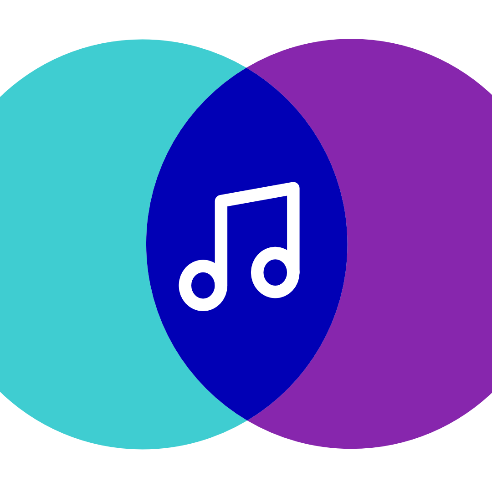

    <h1 align="center">plistsync</h1>

    <em><b>
<!-- start intro -->
Toolbox for transferring, converting and matching music collections and playlists across services.
<!-- end intro -->
    </b></em>

    

## Overview

<!-- start overview -->

**plistsync** is a Python toolbox designed to solve the common problem of fragmented music libraries across different platforms. Whether you're a DJ moving playlists between Traktor and streaming services, a music enthusiast syncing collections between Plex and Spotify, or simply organizing your music across multiple platforms, plistsync provides a unified interface to transfer, convert, and match your music data.

The core of plistsync is its abstraction layer that normalizes tracks, collections, and playlists from various services into a common format, enabling seamless synchronization while handling the complexities of different APIs, authentication methods, and metadata formats.

<!-- end overview -->

## Features

<!-- start features -->

- **Unified Abstraction Layer**: Normalizes tracks, collections, and playlists from various services into a common format, enabling seamless synchronization across platforms
- **Current Service Support**:
  - **Spotify** - Streaming service integration
  - **Tidal** - Hi-Fi music service
  - **Plex** - Personal media server
  - **Traktor** - DJ software collections
  - **Beets** - Music library manager
  - **Local Files** - M3U playlists and file collections
- **Extensible Service Architecture**: The abstraction layer is designed to support arbitrary music services with consistent APIs

<!-- end features -->

## Getting started

If you're new to **plistsync**, start with the documentation:

**Full documentation:** https://docs.plistsync.com

The docs cover:

- Installation and setup
- Service authentication (Spotify, Tidal, Plex, etc.)
- Core concepts (tracks, collections, playlists)
- Usage examples and workflows

## Is This For You?

**plistsync** is intended for users who are comfortable with Python and scripting. It is **not** a point-and-click app — it’s a developer-oriented toolbox for automating music library and playlist workflows.

## License

This project is licensed under the **PolyForm Noncommercial License 1.0.0.**

We chose this license to defend our work in an industry that often exploits artists. It ensures our tools remain focused on empowering creators and communities _not corporations_ without our explicit permission.

See the [LICENSE](LICENSE) file for the full terms.

## Support the Project

If you enjoy this project, there are a few ways you can support us:

- Contribute code: Pull requests, bug reports, and feature suggestions are always welcome!
- Spread the word: Share the project with friends or on social media.
- Donate: Every contribution helps fuel more coffee-powered coding sessions!
  - Donate ETH: 0x81927e76f2f0fAA9e7fD92176a473955DB20Ce55
  - Donate BTC: bc1qw5e0deust6uq94e5s58au82wrakcjmlemw3cy4

---

  <em>Keep your music in sync, everywhere.</em>

