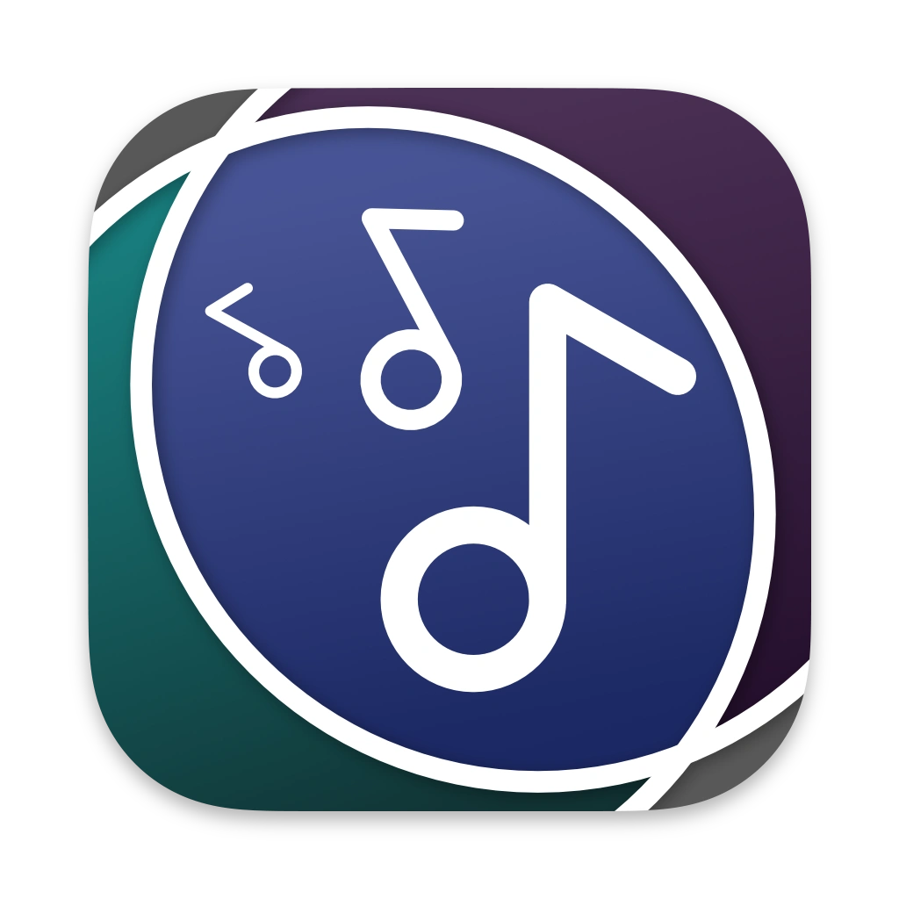

[](https://github.com/metasauce/plistsync/actions/workflows/python.yml)
[](https://pypi.org/project/plistsync/)
[](https://docs.plistsync.com)

<p align="center">
    <h1 align="center">plistsync</h1>
</p>

<p align="center">
    <em><b>
<!-- start intro -->
Toolbox and CLI for transferring, converting, matching and inspecting music collections and playlists across services.
<!-- end intro -->
    </b></em>
</p>

<p align="center">

</p>

## Overview

<!-- start overview -->

**plistsync** is a Python toolbox and Command Line Interface designed to solve the common problem of fragmented music libraries across different platforms. Whether you're a DJ moving playlists between Traktor and streaming services, a music enthusiast syncing collections between Plex and Spotify, or simply organizing your music across multiple platforms, plistsync provides a unified interface to transfer, convert, and match your music data.

The core of plistsync is its abstraction layer that normalizes tracks, libraries, and playlists from various services into a common format, enabling seamless synchronization while handling the complexities of different APIs, authentication methods, and metadata formats.

<!-- end overview -->

## Features

<!-- start features -->

- **Unified Abstraction Layer**: Normalizes tracks, collections, and playlists from various services into a common format and interface
- **Extensible Service Architecture**: The abstraction layer is designed to support arbitrary music services with consistent APIs
  - Currently supports Spotify, Tidal, Plex, Traktor and local files
  - Simplifies creating your own extensions for other services
- **Command Line Interface (CLI)**: Provides a user-friendly CLI for common tasks like syncing playlists, transferring tracks, and managing libraries
- **Python API**: Offers a programmatic interface for developers to integrate plistsync into scripts or own applications
<!-- end features -->

## Getting started

For detailed usage guides, API reference, and examples, see the [full documentation](https://docs.plistsync.com).

Quick start:

```bash
pip install plistsync
plistsync --help
```

## Is this for you?

**Yes**, if you are comfortable in a terminal. The CLI is easy to pick up, and no Python knowledge is required.

If you’re comfortable with writing some code, there’s also a Python API for scripting custom workflows and integrations.

## License

This project is licensed under the **PolyForm Noncommercial License 1.0.0.**

In short, this license allows broad use for personal, educational, research, and non-profit purposes, but forbids commercial use.
We chose it to defend our work in an industry that often exploits artists, where commercial interests seem more important than an inclusive community.

See the [LICENSE](LICENSE) file for the full terms.

## Support the project

If you enjoy this project, there are a few ways you can support us:

- To add Apple Music support, we are currently looking for someone to support us with an Apple Developer Account. (Apple only allows access to its MusicKit API via a paid Developer Account. If you are a Dev and willing to help us out, please get in touch 🫶)
- Contribute code: Pull requests, bug reports, and feature suggestions are always welcome!
- Spread the word: Share the project with friends or on social media.
- Donate: Every contribution helps fuel more coffee-powered coding sessions!
  - Donate ETH: <a href="etherium:0x81927e76f2f0fAA9e7fD92176a473955DB20Ce55" target="_blank">0x81927e76f2f0fAA9e7fD92176a473955DB20Ce55</a>
  - Donate BTC: <a href="bitcoin:bc1qw5e0deust6uq94e5s58au82wrakcjmlemw3cy4" target="_blank">bc1qw5e0deust6uq94e5s58au82wrakcjmlemw3cy4</a>

---

<p align="center">
  <em>Keep your music in sync, everywhere.</em>
</p>
