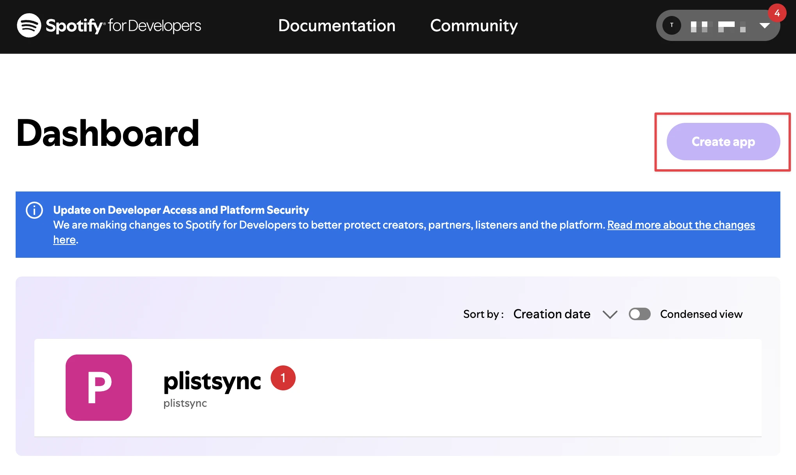

# Getting Started

This guide will help you set up Spotify integration with `plistsync` from start to finish.

## Prerequisites

### Installation

First, install the Spotify optional dependencies:

::::{tab-set}
:sync-group: environment

:::{tab-item} pip
:sync: pip

```bash
pip install 'plistsync[spotify]'
```

:::

:::{tab-item} uv
:sync: uv

```bash
uv add plistsync --extra spotify
```

:::
::::

### Spotify Account

You'll need an active and paid [Spotify account](https://accounts.spotify.com/).

```{note}
Since February 2026, Spotify
- no longer allows access to its API for free accounts
- and limits us to 5 users per App, even for paid accounts.

This means we can no longer provide working API credentials for plistsync users. You have to create you own credentials.
```

### API Credentials

To authenticate with Spotify's API, you need to obtain API credentials:

1. Visit the [Spotify Developer Portal](https://developer.spotify.com/)
2. Log in with your paid Spotify account
3. Create a new application
4. Generate your `client_id` and `client_secret`




## Configuration

Enable Spotify in your `plistsync` configuration file:

```yaml
# ./config/config.yaml
services:
  spotify:
    enabled: true
    client_id: your_spotify_client_id_here
    client_secret: your_spotify_client_secret_here # Optional but recommended
```

## Authentication

Once configured, authenticate `plistsync` with your Spotify account:

```bash
plistsync auth spotify
```

This will start an interactive authentication flow:

1. You'll be prompted to open a browser to Spotify's authorization page
2. Log in with your Spotify credentials
3. Grant `plistsync` the requested permissions
4. This will save an authentication token in the `config` folder

### Authentication Preview

<div class="only-light">

```{typer} cli:app::spotify
---
prog: plistsync auth spotify
theme: light
width: 80
---
```

</div>

<div class="only-dark">

```{typer} cli:app::spotify
---
prog: plistsync auth spotify
theme: dark
width: 80
---
```

</div>

## Verification

Test that everything is working by getting your user data:

```python
from plistsync.services.spotify.api import SpotifyApi
print(SpotifyApi().user.me())
```

This should return your user's ID and email.
