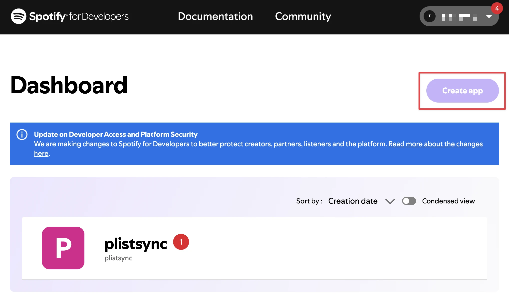

# Getting Started

This guide sets up the Spotify integration with `plistsync` from start to finish.

## Prerequisites

### Spotify account

You need an active and paid [Spotify account](https://accounts.spotify.com/).

```{note}
Since February 2026, Spotify
- no longer allows access to its API for free accounts
- and limits us to 5 users per App, even for paid accounts.

This means we can no longer provide working API credentials for plistsync users. You have to create your own credentials.
```

### API credentials

To authenticate with Spotify's API, you need to obtain API credentials:

1. Visit the [Spotify Developer Portal](https://developer.spotify.com/)
2. Log in with your paid Spotify account
3. Create a new application
4. Generate your `client_id` (the `client_secret` is not needed, `plistsync` uses PKCE)




### Authentication

`plistsync` must be authenticated with your Spotify account, see {ref}`the CLI authentication <spotify-cli-authenticate>` or {ref}`the library authentication <spotify-library-authenticate>`.

## Installation

Install the Spotify optional dependencies:

::::{tab-set}
:sync-group: install-method

:::{tab-item} uv tool
:sync: uv-tool

Installs `plistsync` as a standalone CLI tool.

```bash
uv tool install "plistsync[spotify]"
```

:::

:::{tab-item} pipx
:sync: pipx

Installs `plistsync` as a standalone CLI tool.

```bash
pipx install "plistsync[spotify]"
```

:::

:::{tab-item} uv add
:sync: uv-add

Adds `plistsync` as a dependency of your project.

```bash
uv add plistsync --extra spotify
```

:::

:::{tab-item} pip
:sync: pip

Installs into the current environment.

```bash
pip install "plistsync[spotify]"
```

:::

::::

## Configuration

::::{tab-set}

:::{tab-item} CLI
:sync: cli

By default the `spotify` service has a configuration section in your `plistsync` configuration file. If not, add the following snippet to your `config.yaml`:

```{plistsync-config} plistsync.services.spotify.config.SpotifyConfig
:service: spotify
```

:::

:::{tab-item} Library
:sync: library

Construct a spotify configuration from custom values.

```{plistsync-config} plistsync.services.spotify.config.SpotifyConfig
:type: library
```

:::

::::
